# 魚の種類
## 学生室
### レッドコーラルプラティ
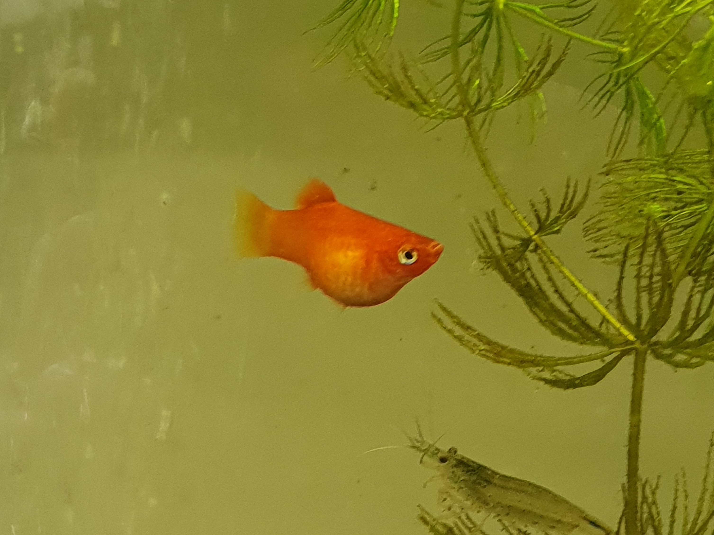

### レッドバックミッキーマウスプラティ
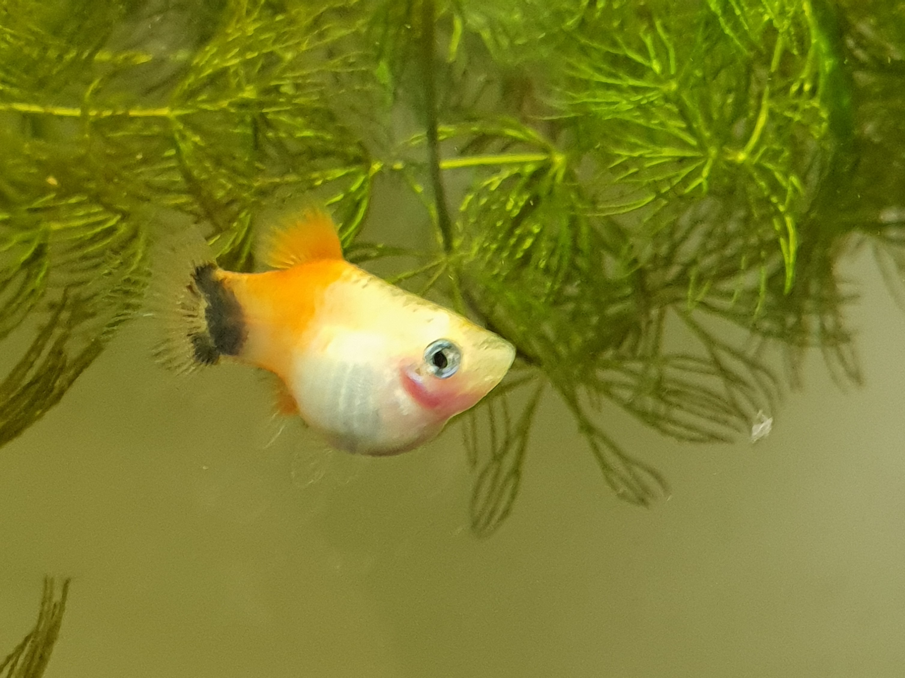

### プレコ1
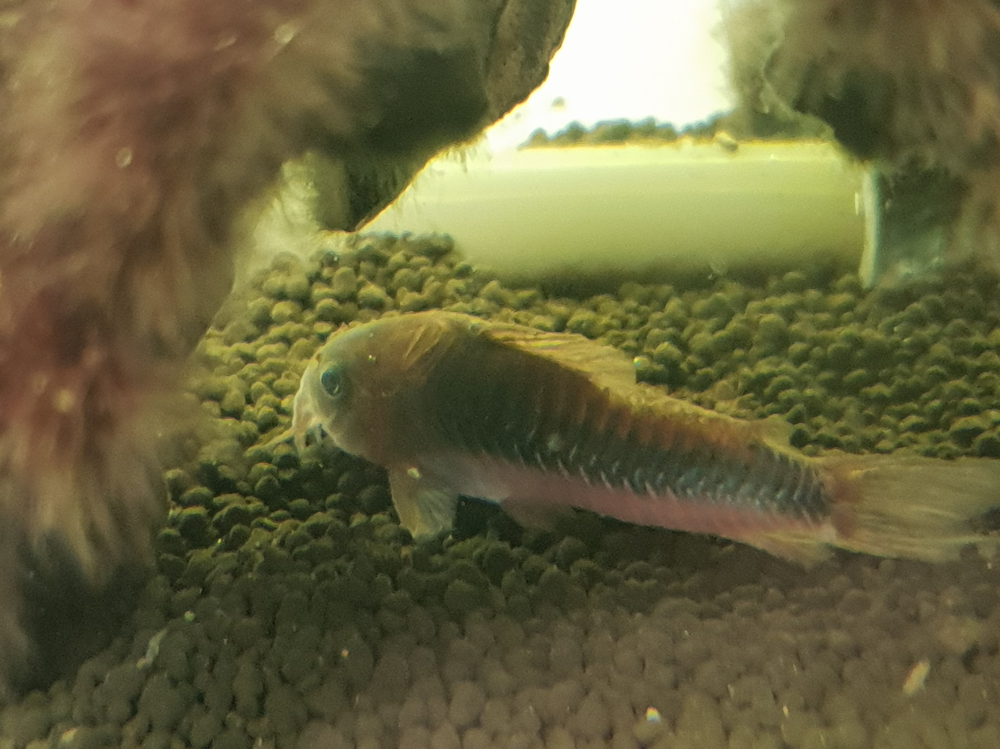

### プレコ2
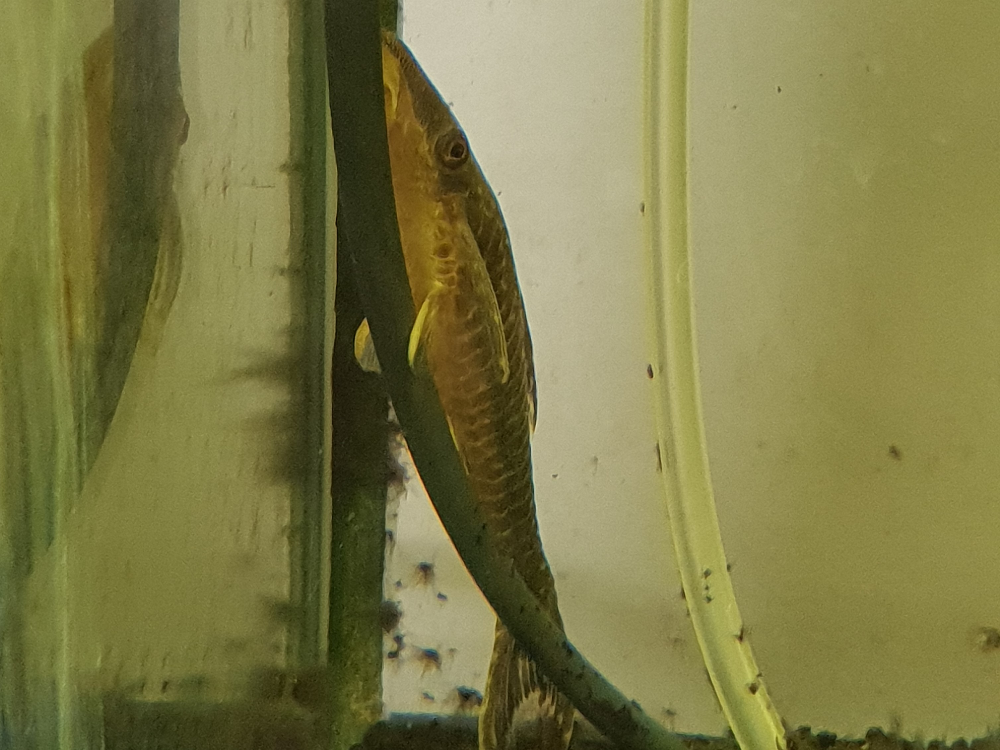

### プレコ3
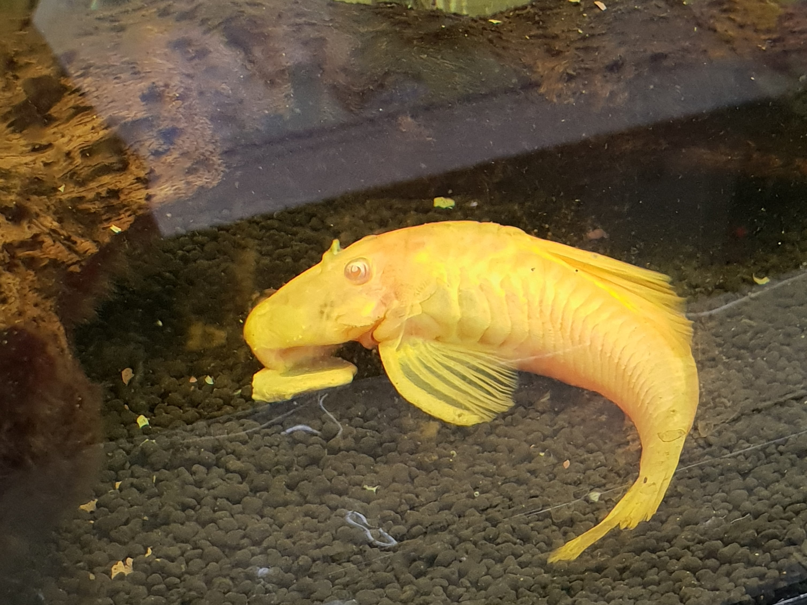

### ヤマトヌマエビ
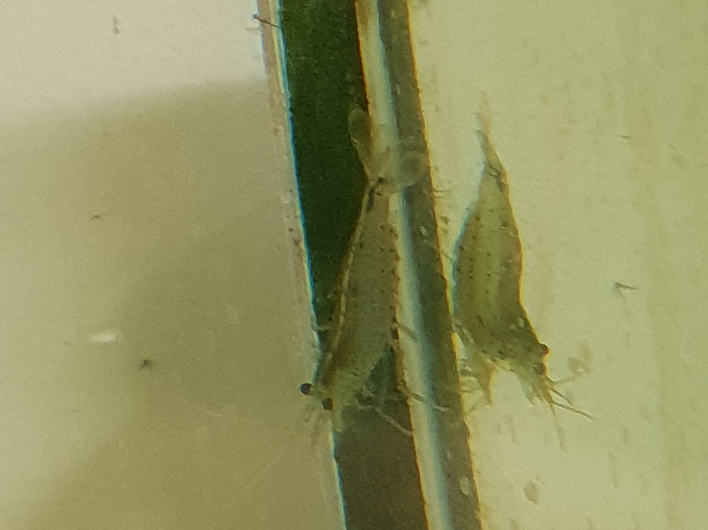

## 事務室
### セルフィンプレコ
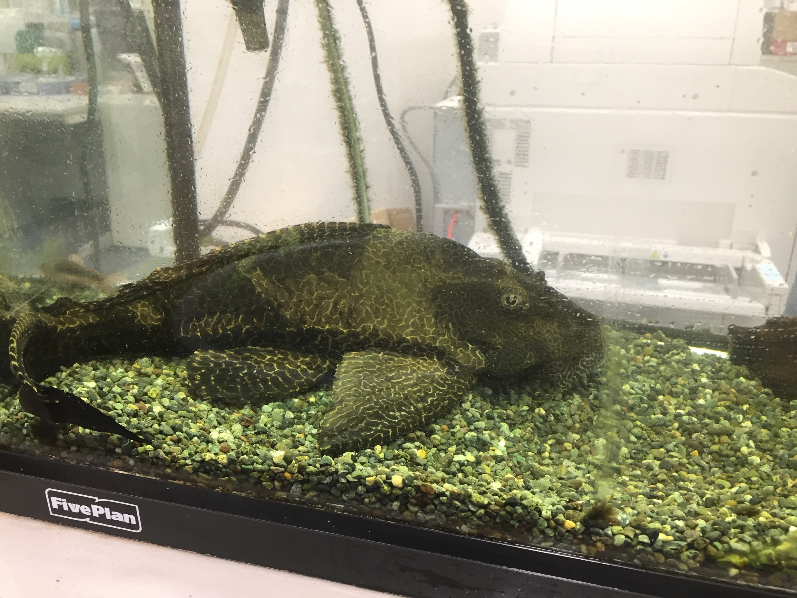

### アルビノコリトラス
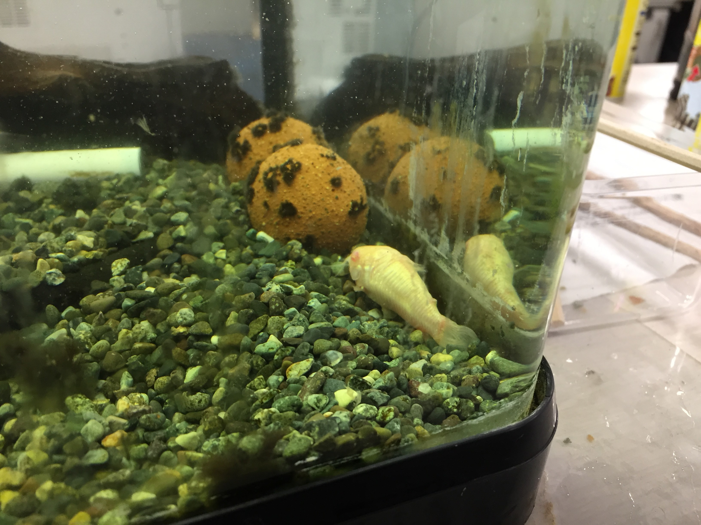

### コリトラス（種類不明）
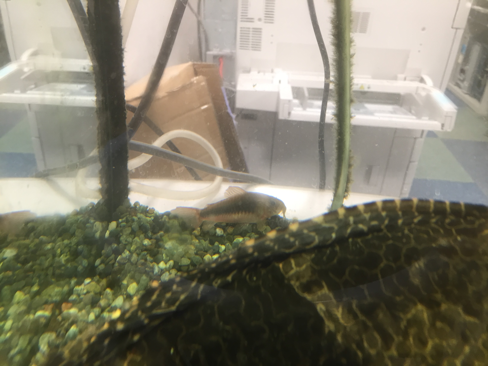

# 世話
## 学生室・事務室共通
### 水槽内の掃除（1週間に1回）
1. 基本的には輪講後だが，都合が合わないときなどはその翌日に掃除する．
2. ヘラで水槽の壁についた汚れや緑色の藻をこそぎ落とす．
3. プロホースで底砂の中に沈んだ糞や汚れ，餌の残りかすと一緒に水を半分ほど吸い取る．
ちょうど大きいバケツで9割程度．プロホースを水槽から抜き取るときは吸い込み口を押さえながらやると吸い取ったものが漏れない．
ごみが詰まったら適宜バケツの中でプロホースのフィルタをすすぐ．
4. 吸い取った水とごみを環情棟の外の排水溝に捨てる．一気にひっくり返すとごみがバケツの中に残らない．
5. 学生室の蛇口から新しい水道水を入れる．学生室の場合はホースで直に，事務室の場合はバケツに汲んで運ぶ．
6. カルキ抜きを入れて混ぜれば終了．

### フィルタ掃除（3～6ヵ月に1回程度）
* 底砂がソイルなら最低3ヵ月に1回は必要．砂利なら6ヵ月に1回程度やれば十分．
（未完成：フィルタ掃除の手順）

### 底砂の入れ替え（1年に1回程度?買った底砂の説明書にしたがってください）
* 底砂を変える際は栄養過多を防ぐのとプロホースで雑に掃除しても吸い込まないようにソイルではなく砂利タイプを敷くとよい．

## 学生室
### 日常

* 藻が繁殖しすぎるのを防いだり，昼と夜のリズムを作るため，毎日12時に電気をつけて18時に消す．
* 電気をつけるときについでに1日1回餌をやる．（上記のメンバーなら）普通の餌はスプーンの1/5程度（写真），プレコの餌は1枚．
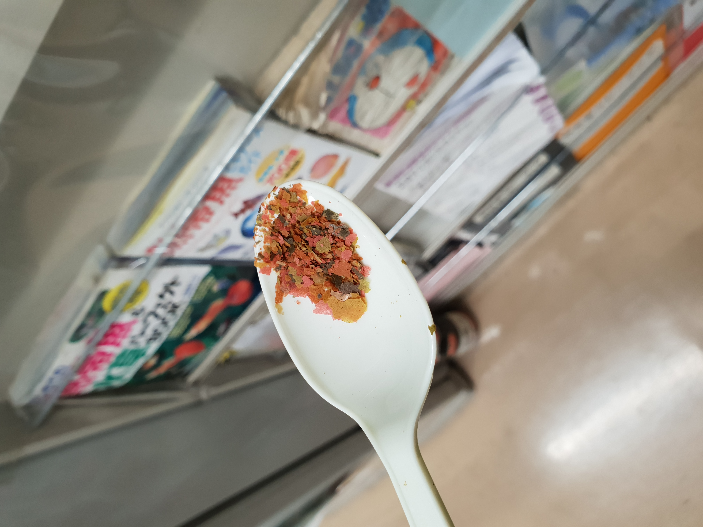

### 掃除
* 稚魚が隠れる場所を確保するため水草をトリミングする際はある程度残す．水槽の底の方に伸びた部分や茶色く枯れた部分をハサミで切るとよい．
* 学生室のポンプはいったん水位が下がると，その後水位が上がっても水を吸わなくなる．ふたたび水を吸わせるために，写真のように一度ポンプを持ち上げポンプの中の水を完全になくす．そしてポンプを戻すと水を吸うようになる．

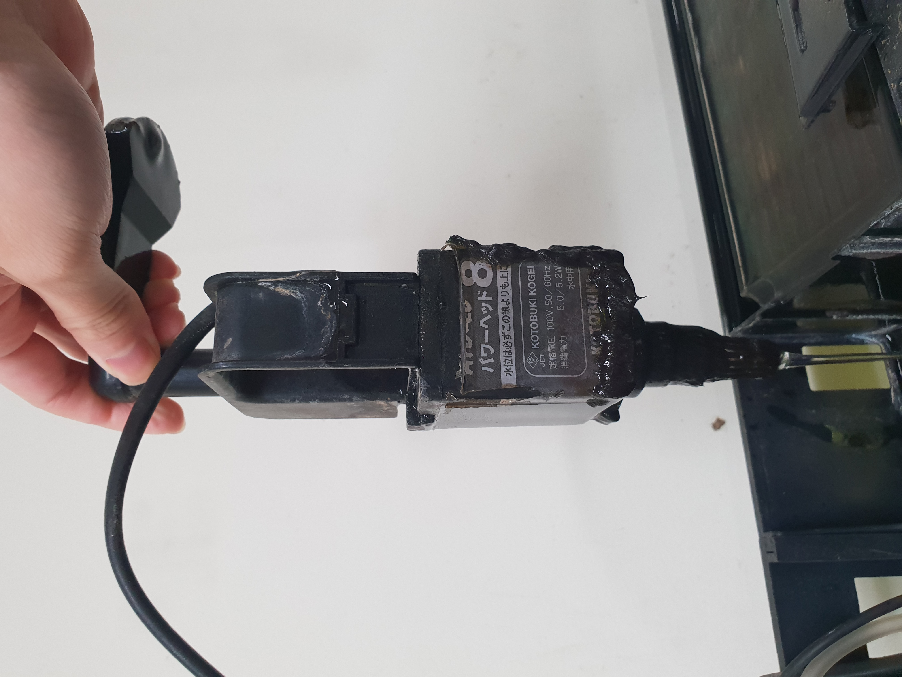

## 事務室

### 日常

* 基本的に事務員の方々が餌をやって電気もON/OFFしてくれているはずなので毎日様子を見に行かなくてよい．

### 掃除

* セルフィンプレコは糞が大きく量も多いためフィルタが詰まったら適宜すすぐ．
* 基本的にはまず片側を掃除して，バケツの半分ほど水を吸ったらホースの先や網でデカプレコを押して反対側に移動させる．その後もう片方を掃除する．

# その他（仮）
熱帯魚ショップの話，プラティの死因の話などを書いとくといいかも．．．
